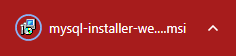
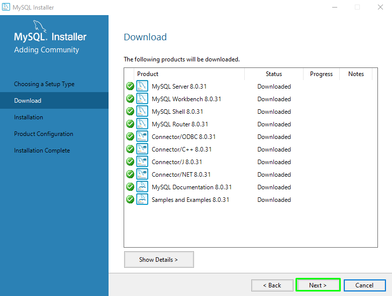

# GBD-Proyecto01
# PROYECTO GBD - GRUPO 4 - Alejandro Ginés, Daniel Trapote y Simon Villarino
# ÍNTRODUCCIÓN
Este readme contiene la memoria sobre el trabajo asignado.
Nos tocó ser el grupo 7 y hacer una base de datos que contenga la información sobre el último Torneo de Roland Garrós y sus participantes.

Se ha divido el trabajo de la siguiente forma:

1. INSTALACIÓN DE MySQL

En este punto se desarrolla la instalación del servidor de MySQL y la configuración de este y los usuaruios de esta.

2. DISEÑO DE LA BASE DE DATOS

Aquí realizamos el diseño de las tablas de nuestra base de datos y como relacionamos los datos de esta.

3. CNEXIÓN DATAGRIP CON LA BASE DE DATOS DE MySQL

El último punto es sobre la como realizamos la conexión a la base de datos y como asignamos a los usuarios los permisos.

4. CONCLUSIONES

Desarrollamos sobre como hemos realizado el trabajo.

## INSTALACIÓN

* Instalar MySQL 

Primero debatios que herramienta de las disponibles era mejor para el trabajo que tenemos que realizar nosotros.

En nuestro caso se ha decidido emplear MySQL HeatWave ya que es gratuito.
MySQL Community Installer: https://dev.mysql.com/downloads/installer/ 

* Descarga desde la página 

Entramos en MySQL y nos desplazamos por la parte de la navegación en busca de las descargas.

Una vez nos ha rediriguido a las descargas encontraremos varios links por lo que cogemos el de Community.

Ahora que hemos escogido la versión podremos buscar la que se adapte a lo que buscamos en nuestro caso el instalador para Windows.

Seleccionamos nuestro sistema operativo, en este caso el primero

En esta pestaña nos pide o realizar un login o registrarnos de vuelta, en nuestro caso lo que hacemos es saltarnos esas opciones dandole a no gracias.

Nos empezará a descargar.

Le damos instalar y se nos abrirá el instalador.

En esta ventana lo que nos está advirtiendo que nos avise cada vez que se haya actualizado el programa se decidió optar por que no lo hiciera.

Seleccionamos Full para que nos instale todo ya que de esta forma intalamos tanto el servidor coomo la parte que hará de router y gestionará las conexiones al servidor y mmás herramientas que igual no usaremos pero no está mal contar con ellas y no tener que reinstalar.

En esta parte de la instalación lo que podemos ver es la posibilidad de conectar MySQL con un editor de textos.

En esta parte nos lanza un aviso el cual nos avisa de que hay algunas cosas que o no se han instalado o no se ha actualizado, y nos pregunta si queremos continuar.
 

Esta es la pantalla de descarga, una vez le demos a execute, ejecutará la descarga y compobación de su correcta descarga.

Aquí vemos la compobación de que no ha fallado, le daremos a nexta para ir a la instalación.

En esta pestaña nos mostrará lo que vamos a instalar.

Tenemos una comprobación sobre el estado de la instalación.

En la siguiente captura podremos ver que se tuvo que escoger el método por el cual se accederá al servidor.

Aquí eMySQL nos instala server como si fuera un servicio para de windows 10 con lo que podríamos tenerlo corriendo siempre en segundo plano.

También tenemos la posibilidad de cambiarle el nombre.

Y de que al iniciar el equipo inicie el servidor, en nuestro caso se desmarcó ya que no lo estaremos usando constantemente y cuando vayamos a trabajar con la base o algo relacionado al proyecto lo iniciamos de forma manual.

En esta pestaña nos indica como queremos hacer el manejo de los datos de MySQL y los usuarios que tienen acceso de lectura u escritura y bloquear el resto.

Esta ventana nos muestra que proceso va a hacer y aplicar al servidor anteriormente instalado.

Después se mira que está correcto y con esto tenemos los usuarios cubiertos y parte de la configuración de este nuestro servidor.

En esta ventana también podremos ver un archivo llamado log el cual nos indica con más detalle el proceso que ha seguido.

Aquí nos muestran los productos que seleccionamos cuando empezamos la instalación a full, nos muestra el estado de estos.

Tenemos que desmarcar la casilla del boostrap.

Nuestro puerto será: 3306

Luego dependiendo de la conexión podremos hacer que directamente con el puerto solo pueda leer y no modificar datos.

En esta parte vemos que ya tenemos configurados tanto el server como el

Ahora tenemos que realizar una conexión para ello seleccionamos nuestro servidor y nos conectamos con el usuario root.

Despúes se hace un chequeo de todo para asegurar que no hay fallos.

Otra vez vemos que todo está correcto y con esto terminamos la instalación.

Aquí podemos hacer que se inicie el servidor cada vez que iniciemos el equipo nosotro lo hemos desactivado puesto que lo haremos de forma local.

* Contraseña de root 

Al root le hemos puesto durante la instalación la contraseña de 12345a para tener eso cubierto ya que por defecto el usuario root su contraseña por defecto está vacía por lo que le asignamos una para evittar que un usuario externo a la base de datos pueda modificarla o entrar.

* Como se ha creado la base de datos 

* Usuarios y persmisos (nombre, contraseña y cómo se ha creado) 

## DISEÑO

* Tablas 

Se decidió crear cinco tablas para contener la información del torneo.

Las cuales son :
1. JUGADORES
2. PARTIDOS
3. PUNTUACIONES
4. PAISES
5. GÉNEROS

* Que se guarda en cada una 

1. JUGADORES

* Id_jugador

Es un identificador que se asigna al jugador para relacionar los datos, será la clave primaria porque es un id que se asocia a un solo jugador y no se repite.

* Nombre

El nombre del participante del torneo.

* Apellidos

Es el apellido del jugador.

* Id_género

Es una clave que viene de la tabla géneros en la cual relacionamos al participante con uno de los géreros, para saber a que parte del torneo participa.

* Fecha_nacimiento

La fecha de nacimiento del participante.

* Id_país  

Es una clave que viene de la tabla países y nos indica el país del participante.

2. PARTIDOS

* Id_partido

Asignamos un identificador al partido puesto que se juegan un total de 96 partidos y cada partido es único, por lo que le designamos como clave principal 

* Id_jugador1 y Id_jugador2

En cada partido tendremos solo dos jugadores y para relacionar los sets le asignamos a cada uno una de estas id para diferenciarlos.

* Nº_sección

Es el número de la sección o momento del torneo, hay 9 secciones que van desde la 1 hasta la 8 y la sección 0 es la final.

* Nº_ronda

Cada sección se divide en rondas, de las secciones de la 1 a la 8 se dividen en cuatro rondas, pero en la sección 0 se divide en tres secciones siendo cuartos, semifinales y finales.

* Fecha

Es la fecha en la que se juega el partido.

3. PUNTUACIONES

* Id_partido

Es el número de partido del 1 a 96.

* Nº_set

Hace referencia al set que se está jugando, este puede ir desde 1 a 5

* Punt_jugador1 y Punt_jugador2

Dividimos los dos jugadores del set para almacenar cual es la puntuación de este set y relacionarla con el nº del set.

4. PAISES

* Id_país

Almcenará un número por país que no se repite.

* Nombre 

Es el nombre del país.

5. GÉNEROS

* Id_género

Se asigna un identificador al género para relacionar este con otras tablas.

* Nombre 

Almacena el nombre del gérnero.

* Como se relacionan 

JUGADORES

PARTIDOS

PUNTUACIONES

## CONEXIÓN

* Pantallazo de datagrip  

Una vez hemos terminado con la instalación y configuración del servidor de MySQL y realizado el diseño de las base de datos, haremos la conexión entre MySQL y DataGrip.

Entramos en DataGrip y añadimos una nueva conexión con MySQL, en este caso haremos dos conexiones puesto que tenemos dos usuarios.

Una como root con la que luego aislaremos el otro usuario para que solo acceda a la base de datos de tenis.
Y el segundo usuario que es administrador.

  

En la primera conexión se hará con el root de tener bien puestos:

Nos tendremos que asegurar.

1.  El user, tendrá que ser root.
2.  El puerto, que en nuestro caso es el 3306.
3.  La contraseña del root será la que le pusimos durante la instalación.

  

En la segunda tendremos que hacer la conexión con el usuario que va a minupular la base de datos.

Y contendrá los siguientes datos.

1.  El user, tendrá que ser el usuario en este caso Simon.
2.  El puerto, que en nuestro caso es el 3306.
3.  La contraseña del usuario será la que le pusimos durante la instalación.

* Explicación 

## CONCLUSIONES

* Dificultades 

1. 

2. 

* Problemas 

1. 

2. 

* Cosas positivas 

1. 

2. 

* Reflexiones 

1. 

2. 