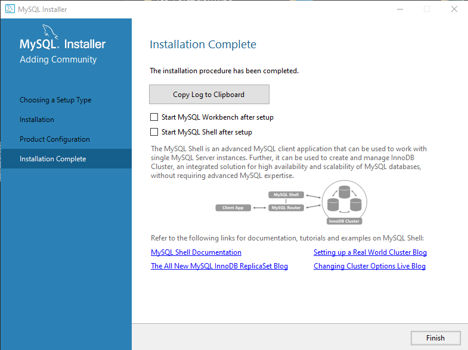

# GBD-Proyecto01
# PROYECTO GBD - GRUPO 4 - Alejandro Ginés, Daniel Trapote y Simon Villarino

## INSTALACIÓN

* Instalar MySQL 

Primero debatios que herramienta de las disponibles era mejor para el trabajo que tenemos que realizar nosotros.
En nuestro caso se ha decidido emplear MySQL HeatWave ya que es gratuito.
MySQL Community Installer: https://dev.mysql.com/downloads/installer/ 

Descarga desde la página 
Entramos en MySQL y nos desplazamos por la parte de la navegación en busca de las descargas.

Una vez nos ha rediriguido a las descargas encontraremos varios links por lo que cogemos el de Community.

Ahora que hemos escogido la versión podremos buscar la que se adapte a lo que buscamos en nuestro caso el instalador para Windows.

Seleccionamos nuestro sistema operativo, en este caso el primero

En esta pestaña nos pide o realizar un login o registrarnos de vuelta, en nuestro caso lo que hacemos es saltarnos esas opciones dandole a no gracias.

Nos empezará a descargar.

Le damos instalar y se nos abrirá el instalador.

En esta ventana lo que nos está advirtiendo que nos avise cada vez que se haya actualizado el programa se decidió optar por que no lo hiciera.

Seleccionamos el tipo de instalación a 

* Contraseña de root 

Al root le hemos puesto durante la instalación la contraseña de 12345a para 
tener eso cubierto ya que por defecto el usuario root su contraseña por defecto está vacía por lo que le asignamos una para evittar que un usuario externo a la base de datos pueda modificarla o entrar.

* Como se ha creado la base de datos 

* Usuarios y persmisos (nombre, contraseña y cómo se ha creado) 

(METER IMÁGENES) 

## DISEÑO

* Tablas 

* Que se guarda en cada una 

* Como se relacionan 

## CONEXIÓN

* Pantallazo de datagrip  

* Explicación 

## CONCLUSIONES

* Dificultades 

* Problemas 

* Cosas positivas 

* Reflexiones 